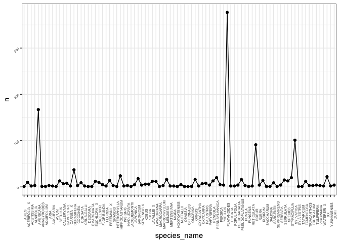
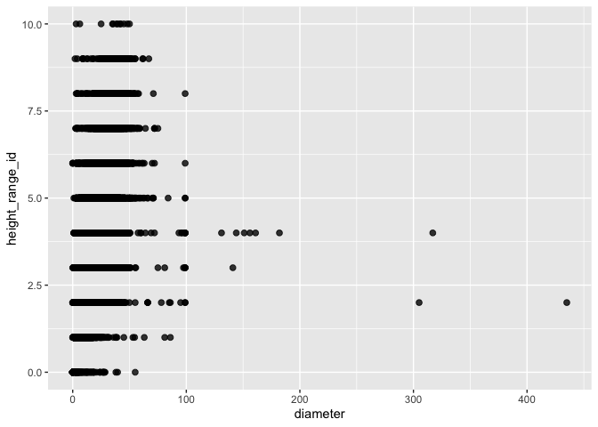
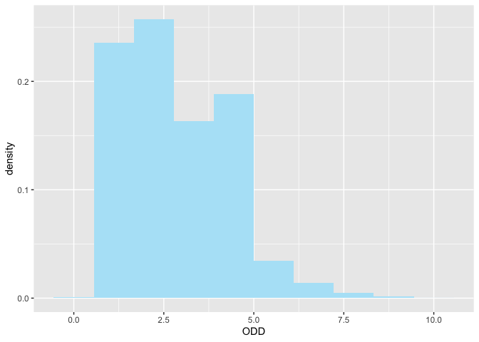
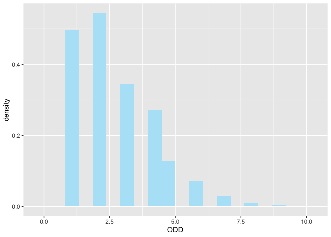
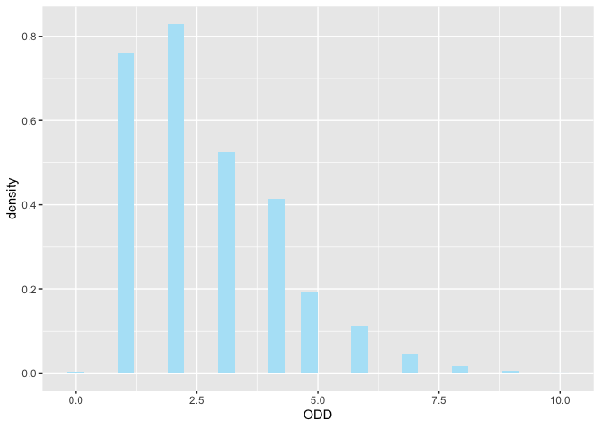
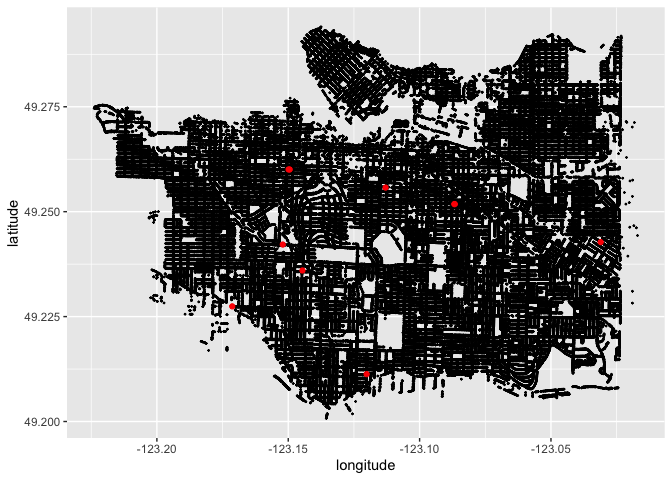

Mini Data Analysis Milestone 2
================

*To complete this milestone, you can either edit [this `.rmd`
file](https://raw.githubusercontent.com/UBC-STAT/stat545.stat.ubc.ca/master/content/mini-project/mini-project-2.Rmd)
directly. Fill in the sections that are commented out with
`<!--- start your work here--->`. When you are done, make sure to knit
to an `.md` file by changing the output in the YAML header to
`github_document`, before submitting a tagged release on canvas.*

# Welcome to the rest of your mini data analysis project!

In Milestone 1, you explored your data. and came up with research
questions. This time, we will finish up our mini data analysis and
obtain results for your data by:

- Making summary tables and graphs
- Manipulating special data types in R: factors and/or dates and times.
- Fitting a model object to your data, and extract a result.
- Reading and writing data as separate files.

We will also explore more in depth the concept of *tidy data.*

**NOTE**: The main purpose of the mini data analysis is to integrate
what you learn in class in an analysis. Although each milestone provides
a framework for you to conduct your analysis, it’s possible that you
might find the instructions too rigid for your data set. If this is the
case, you may deviate from the instructions – just make sure you’re
demonstrating a wide range of tools and techniques taught in this class.

# Instructions

**To complete this milestone**, edit [this very `.Rmd`
file](https://raw.githubusercontent.com/UBC-STAT/stat545.stat.ubc.ca/master/content/mini-project/mini-project-2.Rmd)
directly. Fill in the sections that are tagged with
`<!--- start your work here--->`.

**To submit this milestone**, make sure to knit this `.Rmd` file to an
`.md` file by changing the YAML output settings from
`output: html_document` to `output: github_document`. Commit and push
all of your work to your mini-analysis GitHub repository, and tag a
release on GitHub. Then, submit a link to your tagged release on canvas.

**Points**: This milestone is worth 50 points: 45 for your analysis, and
5 for overall reproducibility, cleanliness, and coherence of the Github
submission.

**Research Questions**: In Milestone 1, you chose two research questions
to focus on. Wherever realistic, your work in this milestone should
relate to these research questions whenever we ask for justification
behind your work. In the case that some tasks in this milestone don’t
align well with one of your research questions, feel free to discuss
your results in the context of a different research question.

# Learning Objectives

By the end of this milestone, you should:

- Understand what *tidy* data is, and how to create it using `tidyr`.
- Generate a reproducible and clear report using R Markdown.
- Manipulating special data types in R: factors and/or dates and times.
- Fitting a model object to your data, and extract a result.
- Reading and writing data as separate files.

# Setup

Begin by loading your data and the tidyverse package below:

``` r
library(datateachr) # <- might contain the data you picked!
library(tidyverse)
```

# Task 1: Process and summarize your data

From milestone 1, you should have an idea of the basic structure of your
dataset (e.g. number of rows and columns, class types, etc.). Here, we
will start investigating your data more in-depth using various data
manipulation functions.

### 1.1 (1 point)

First, write out the 4 research questions you defined in milestone 1
were. This will guide your work through milestone 2:

<!-------------------------- Start your work below ---------------------------->

1.  What specific street in Vancouver contains the largest density of
    trees from different species?

2.  What species has the largest height and diameter compared to the
    species with the smallest height and diameter?

3.Does the street side name have effect on the growth of the trees in
terms of height and species, or is it negligible?

4.  Are certain species that are generally tall greatly influenced by
    the neighbourhood environment they are in or is their growth
    constant regardless of the condition?

<!----------------------------------------------------------------------------->

Here, we will investigate your data using various data manipulation and
graphing functions.

### 1.2 (8 points)

Now, for each of your four research questions, choose one task from
options 1-4 (summarizing), and one other task from 4-8 (graphing). You
should have 2 tasks done for each research question (8 total). Make sure
it makes sense to do them! (e.g. don’t use a numerical variables for a
task that needs a categorical variable.). Comment on why each task helps
(or doesn’t!) answer the corresponding research question.

Ensure that the output of each operation is printed!

Also make sure that you’re using dplyr and ggplot2 rather than base R.
Outside of this project, you may find that you prefer using base R
functions for certain tasks, and that’s just fine! But part of this
project is for you to practice the tools we learned in class, which is
dplyr and ggplot2.

**Summarizing:**

1.  Compute the *range*, *mean*, and *two other summary statistics* of
    **one numerical variable** across the groups of **one categorical
    variable** from your data.
2.  Compute the number of observations for at least one of your
    categorical variables. Do not use the function `table()`!
3.  Create a categorical variable with 3 or more groups from an existing
    numerical variable. You can use this new variable in the other
    tasks! *An example: age in years into “child, teen, adult, senior”.*
4.  Compute the proportion and counts in each category of one
    categorical variable across the groups of another categorical
    variable from your data. Do not use the function `table()`!

**Graphing:**

6.  Create a graph of your choosing, make one of the axes logarithmic,
    and format the axes labels so that they are “pretty” or easier to
    read.
7.  Make a graph where it makes sense to customize the alpha
    transparency.

Using variables and/or tables you made in one of the “Summarizing”
tasks:

8.  Create a graph that has at least two geom layers.
9.  Create 3 histograms, with each histogram having different sized
    bins. Pick the “best” one and explain why it is the best.

Make sure it’s clear what research question you are doing each operation
for!

<!------------------------- Start your work below ----------------------------->

#### Analysis Q#1: What specific street in Vancouver contains the largest density of trees from different species?

**Summarizing Q4: Computing Counts and Proportions**

``` r
#Creating count variable
large_density_count <-vancouver_trees %>%
  group_by(std_street,species_name ) %>%
  summarise(n = n()) 
```

    ## `summarise()` has grouped output by 'std_street'. You can override using the
    ## `.groups` argument.

``` r
#Making count variable in descending order
large_density_desc <-arrange(large_density_count, desc(n))

print(large_density_desc)
```

    ## # A tibble: 18,154 × 3
    ## # Groups:   std_street [805]
    ##    std_street       species_name      n
    ##    <chr>            <chr>         <int>
    ##  1 W 13TH AV        PLATANOIDES     377
    ##  2 W 15TH AV        PLATANOIDES     276
    ##  3 KINGSWAY         RUBRUM          273
    ##  4 W 11TH AV        PLATANOIDES     254
    ##  5 E 45TH AV        EUCHLORA   X    248
    ##  6 E 1ST AV         BETULUS         237
    ##  7 W 14TH AV        HIPPOCASTANUM   224
    ##  8 E 22ND AV        SERRULATA       212
    ##  9 W KING EDWARD AV PLATANOIDES     212
    ## 10 W 6TH AV         PLATANOIDES     204
    ## # ℹ 18,144 more rows

``` r
#Creating proportion variable
large_density_prop <- large_density_desc %>% 
  mutate(n = n / sum(n)) %>% 
  pivot_wider(names_from = std_street, values_from = n)

print(large_density_prop)
```

    ## # A tibble: 283 × 806
    ##    species_name  `W 13TH AV` `W 15TH AV` KINGSWAY `W 11TH AV` `E 45TH AV`
    ##    <chr>               <dbl>       <dbl>    <dbl>       <dbl>       <dbl>
    ##  1 PLATANOIDES       0.298       0.251    0.0121      0.295       0.0765 
    ##  2 RUBRUM            0.0111      0.0255   0.330       0.0186      0.0264 
    ##  3 EUCHLORA   X      0.00949     0.0364   0.0145     NA           0.345  
    ##  4 BETULUS           0.0103      0.00818  0.0109      0.00116     0.0417 
    ##  5 HIPPOCASTANUM     0.0190      0.0436  NA           0.0244      0.00139
    ##  6 SERRULATA         0.0119      0.0627   0.0145      0.0279      0.0431 
    ##  7 SYLVATICA         0.0799      0.0109   0.100       0.0453      0.00556
    ##  8 AMERICANA         0.132       0.0355   0.00362     0.0325      0.0223 
    ##  9 CERASIFERA        0.0293      0.0436   0.00966     0.0372      0.0181 
    ## 10 KOBUS             0.00475    NA        0.00604     0.0267      0.0223 
    ## # ℹ 273 more rows
    ## # ℹ 800 more variables: `E 1ST AV` <dbl>, `W 14TH AV` <dbl>, `E 22ND AV` <dbl>,
    ## #   `W KING EDWARD AV` <dbl>, `W 6TH AV` <dbl>, `W BROADWAY` <dbl>,
    ## #   `W 16TH AV` <dbl>, `W 7TH AV` <dbl>, `GRANVILLE ST` <dbl>,
    ## #   `CONNAUGHT DRIVE` <dbl>, `E HASTINGS ST` <dbl>, `ANGUS DRIVE` <dbl>,
    ## #   `E KENT AV NORTH` <dbl>, `E 55TH AV` <dbl>, `W 22ND AV` <dbl>,
    ## #   `BOUNDARY ROAD` <dbl>, `W 26TH AV` <dbl>, `HEATHER ST` <dbl>, …

``` r
#Creating W13AV count variable
W13AV_count <- large_density_count %>%
   filter(std_street %in% c("W 13TH AV"))

print(W13AV_count) 
```

    ## # A tibble: 88 × 3
    ## # Groups:   std_street [1]
    ##    std_street species_name       n
    ##    <chr>      <chr>          <int>
    ##  1 W 13TH AV  ABIES              1
    ##  2 W 13TH AV  ACERIFOLIA   X    10
    ##  3 W 13TH AV  ACUTISSIMA         2
    ##  4 W 13TH AV  ALNIFOLIA          3
    ##  5 W 13TH AV  AMERICANA        167
    ##  6 W 13TH AV  ANAGYROIDES        1
    ##  7 W 13TH AV  AQUIFOLIUM         1
    ##  8 W 13TH AV  ARIA               3
    ##  9 W 13TH AV  AUCUPARIA          2
    ## 10 W 13TH AV  AVIUM              1
    ## # ℹ 78 more rows

This task has answered my research question \#1.In order to determine
the specific street in Vancouver with the largest density of a certain
type of tree I first created a count variable. This count variable
determined the number of species on a certain street, and after I sorted
the tibble into descending order to determine the street with the
highest count. Thereafter I also determined the proportions of the
species as well. From the tables above, it is evident that W 13th Av has
the most trees of the Platanoides species with a count of n= 377 and
proportion of 0.298. I created a new variable on W13AV_count to
determine the relative proportion of Platanoides in comparison to other
tree species on this street.

**Graphing Q8: Creating Graph with Two Geom Layers**

``` r
#Creating W13AV ggplot with geom layers
W13AV_geom2 <- ggplot(W13AV_count, aes(x = species_name, y = n)) + 
  geom_line(aes(group=1)) + geom_point() + theme_bw()

#Swapping axis sideways and adding title 
W13AV_graph <- W13AV_geom2 + theme(axis.text.x = element_text( size = 5, angle = 90),
          axis.text.y = element_text( size = 5, angle = 45)) 

print(W13AV_graph)
```

<!-- -->

In the graph above I incorporated two geom layers of geom_line and
geom_point in order to visualize the different species on W13AV using
the W13AV_count variable. From this graph I can conclude that
Platanoids, Americana and Sylvatica are the top 3 tree species on this
street. The difference in the count of Platanoids compared to the other
species are tremendous as shown in the graph.

#### Analysis Q#2: What species has the largest height and diameter compared to the species with the smallest height and diameter?

**Summarizing Q1: Compute range, mean, and two other summary
statistics**

``` r
#Broom Library 
library(broom)

#Determining summary statistics of height and diameter  
stat_species <- vancouver_trees %>% select(height_range_id, diameter)  %>% tidy()
```

    ## Warning: Data frame tidiers are deprecated and will be removed in an upcoming
    ## release of broom.

``` r
print(stat_species)
```

    ## # A tibble: 2 × 13
    ##   column              n  mean    sd median trimmed   mad   min   max range  skew
    ##   <chr>           <dbl> <dbl> <dbl>  <dbl>   <dbl> <dbl> <dbl> <dbl> <dbl> <dbl>
    ## 1 height_range_… 146611  2.63  1.54      2    2.43     1     0    10    10  1.02
    ## 2 diameter       146611 11.5   9.21      9   10.1      6     0   435   435  2.52
    ## # ℹ 2 more variables: kurtosis <dbl>, se <dbl>

``` r
#Determining species names with max diameter   
max_diam <- vancouver_trees %>% select(species_name, height_range_id, diameter) %>%  
  filter(diameter == 435)

print(max_diam)
```

    ## # A tibble: 1 × 3
    ##   species_name height_range_id diameter
    ##   <chr>                  <dbl>    <dbl>
    ## 1 JAPONICA                   2      435

``` r
#Determining species names with min diameter   
min_diam <- vancouver_trees %>% select(species_name, height_range_id, diameter) %>% 
  filter(diameter == 0)

print(min_diam)
```

    ## # A tibble: 92 × 3
    ##    species_name  height_range_id diameter
    ##    <chr>                   <dbl>    <dbl>
    ##  1 STYRACIFLUA                 2        0
    ##  2 CAMPESTRE                   0        0
    ##  3 CERASIFERA                  0        0
    ##  4 X YEDOENSIS                 0        0
    ##  5 XX                          0        0
    ##  6 GRANDIFLORA X               0        0
    ##  7 PERSICA                     0        0
    ##  8 CERASIFERA                  0        0
    ##  9 JAPONICA                    0        0
    ## 10 PLATANOIDES                 6        0
    ## # ℹ 82 more rows

``` r
#Determining species names with max height   
max_height <- vancouver_trees %>% select(species_name, height_range_id, diameter) %>% 
  filter(height_range_id == 10)

print(max_height)
```

    ## # A tibble: 12 × 3
    ##    species_name height_range_id diameter
    ##    <chr>                  <dbl>    <dbl>
    ##  1 AMERICANA                 10    45   
    ##  2 AMERICANA                 10    35.5 
    ##  3 PSEUDOACACIA              10     3   
    ##  4 RUBRA                     10    50   
    ##  5 RUBRA                     10    42   
    ##  6 PLICATA                   10    38.5 
    ##  7 PALMATUM                  10     6.25
    ##  8 MENZIESII                 10    39.5 
    ##  9 MENZIESII                 10    35   
    ## 10 MENZIESII                 10    42   
    ## 11 SPECIES                   10    25   
    ## 12 TRICHOCARPA               10    48

``` r
#Determining species names with min height   
min_height <- vancouver_trees %>% select(species_name, height_range_id, diameter) %>% 
    filter( height_range_id == 0)

print(min_height)
```

    ## # A tibble: 214 × 3
    ##    species_name height_range_id diameter
    ##    <chr>                  <dbl>    <dbl>
    ##  1 AMERICANA                  0      4  
    ##  2 CAMPESTRE                  0      6  
    ##  3 ARIA                       0     28.5
    ##  4 CAMPESTRE                  0      0  
    ##  5 CERASIFERA                 0      0  
    ##  6 RUBRUM                     0      3  
    ##  7 RUBRUM                     0      3  
    ##  8 X YEDOENSIS                0      0  
    ##  9 SARGENTII                  0      6.5
    ## 10 SARGENTII                  0      8  
    ## # ℹ 204 more rows

The task of determining the summary statistics has answered research
question \#2. I first loaded the broom library in order to complete the
analyses. I was able to create a new tibble with summary statistics
using the broom package to find the height and diameters of the tree
species. By arranging the columns of the Vancouver_trees dataset, I
determined that the species with the largest diameter of 435 was
Japonica. The other values of maximum height of 10, and minimum
height/diameter of 0 does not seem to be significant as there are
multiple trees with these dimensions.

**Graphing Q7: Creating Graph with Alpha Transparency**

``` r
#Creating dimension_trees ggplot with alpha transparency
dimension_trees <-ggplot(vancouver_trees, aes(x=diameter, y=height_range_id))+ 
  geom_point(size = 2,
            alpha = 0.8) 

print(dimension_trees)
```

<!-- -->

In this graph I chose to add in alpha transparency as there were
multiple points at the similar heights and diameter ranges which needed
to be differentiated from one another. This plot also visualizes the
maximum and minimum height ranges and diameters, however species name
was not determined.

#### Analysis Q#3: Does the street side name have effect on the growth of the trees in terms of height and species, or is it negligible?

**Summarizing Q1: Compute range, mean, and two other summary
statistics**

``` r
#Widening dataset with street side names 
street_wide <- vancouver_trees %>% 
  pivot_wider(names_from = street_side_name,
                values_from = height_range_id)

print(street_wide)
```

    ## # A tibble: 146,611 × 24
    ##    tree_id civic_number std_street    genus_name species_name cultivar_name  
    ##      <dbl>        <dbl> <chr>         <chr>      <chr>        <chr>          
    ##  1  149556          494 W 58TH AV     ULMUS      AMERICANA    BRANDON        
    ##  2  149563          450 W 58TH AV     ZELKOVA    SERRATA      <NA>           
    ##  3  149579         4994 WINDSOR ST    STYRAX     JAPONICA     <NA>           
    ##  4  149590          858 E 39TH AV     FRAXINUS   AMERICANA    AUTUMN APPLAUSE
    ##  5  149604         5032 WINDSOR ST    ACER       CAMPESTRE    <NA>           
    ##  6  149616          585 W 61ST AV     PYRUS      CALLERYANA   CHANTICLEER    
    ##  7  149617         4909 SHERBROOKE ST ACER       PLATANOIDES  COLUMNARE      
    ##  8  149618         4925 SHERBROOKE ST ACER       PLATANOIDES  COLUMNARE      
    ##  9  149619         4969 SHERBROOKE ST ACER       PLATANOIDES  COLUMNARE      
    ## 10  149625          720 E 39TH AV     FRAXINUS   AMERICANA    AUTUMN APPLAUSE
    ## # ℹ 146,601 more rows
    ## # ℹ 18 more variables: common_name <chr>, assigned <chr>, root_barrier <chr>,
    ## #   plant_area <chr>, on_street_block <dbl>, on_street <chr>,
    ## #   neighbourhood_name <chr>, diameter <dbl>, curb <chr>, date_planted <date>,
    ## #   longitude <dbl>, latitude <dbl>, EVEN <dbl>, ODD <dbl>, MED <dbl>,
    ## #   PARK <dbl>, `BIKE MED` <dbl>, GREENWAY <dbl>

``` r
#Creating variable of only street side names 
street_height <- street_wide %>% 
    select(ODD, EVEN, MED, PARK, `BIKE MED`, GREENWAY)

print(street_height)
```

    ## # A tibble: 146,611 × 6
    ##      ODD  EVEN   MED  PARK `BIKE MED` GREENWAY
    ##    <dbl> <dbl> <dbl> <dbl>      <dbl>    <dbl>
    ##  1    NA     2    NA    NA         NA       NA
    ##  2    NA     4    NA    NA         NA       NA
    ##  3    NA     3    NA    NA         NA       NA
    ##  4    NA     4    NA    NA         NA       NA
    ##  5    NA     2    NA    NA         NA       NA
    ##  6     2    NA    NA    NA         NA       NA
    ##  7     3    NA    NA    NA         NA       NA
    ##  8     3    NA    NA    NA         NA       NA
    ##  9     2    NA    NA    NA         NA       NA
    ## 10    NA     2    NA    NA         NA       NA
    ## # ℹ 146,601 more rows

``` r
#Creating summary variable of street side names 
street_height_sum <- tidy(street_height) 
```

    ## Warning: Data frame tidiers are deprecated and will be removed in an upcoming
    ## release of broom.

``` r
print(street_height_sum)
```

    ## # A tibble: 6 × 13
    ##   column     n  mean    sd median trimmed   mad   min   max range  skew kurtosis
    ##   <chr>  <dbl> <dbl> <dbl>  <dbl>   <dbl> <dbl> <dbl> <dbl> <dbl> <dbl>    <dbl>
    ## 1 ODD    71374  2.68 1.56       2    2.48     1     0    10    10    NA       NA
    ## 2 EVEN   71753  2.61 1.54       2    2.41     1     0    10    10    NA       NA
    ## 3 MED     3297  1.96 1.13       2    1.76     1     0     9     9    NA       NA
    ## 4 PARK     144  1.05 0.583      1    1        0     1     8     7    NA       NA
    ## 5 BIKE …    38  1.32 0.525      1    1.25     0     1     3     2    NA       NA
    ## 6 GREEN…     5  3.4  1.52       3    3.4      1     2     5     3    NA       NA
    ## # ℹ 1 more variable: se <dbl>

This task partially answered research question 3. For each of the
different street side names I was able to determine statistics about the
ODD, EVEN, MED, PARK, BIKE MED and GREENWAY locations. This included the
mean, standard deviation, median, min, max, range and other values. From
the tibble I can determine that the ODD and EVEN street sides have the
highest tree height and the ODD sides have the highest mean for height
as well. Since the values are simmilar, I can conclude that strret side
name does not have an overall big impact on the growth of trees since
the number of trees between ODD and EVEN where very similar. However,
through this analysis I was unable to answer the question of which
specific species is abundant on the street sides.

**Graphing Q9: Create 3 histograms, with each histogram having different
sized bins.**

``` r
#Creating histogram with bin size 10 
hist_1 <-ggplot(street_height, aes(x = ODD, y = ..density..)) +
        geom_histogram(bins = 10,  fill = "#B3E4F7")

print(hist_1)
```

    ## Warning: The dot-dot notation (`..density..`) was deprecated in ggplot2 3.4.0.
    ## ℹ Please use `after_stat(density)` instead.
    ## This warning is displayed once every 8 hours.
    ## Call `lifecycle::last_lifecycle_warnings()` to see where this warning was
    ## generated.

    ## Warning: Removed 75237 rows containing non-finite values (`stat_bin()`).

<!-- -->

``` r
#Creating histogram with bin size 20 
hist_2 <-ggplot(street_height, aes(x = ODD, y = ..density..)) +
        geom_histogram(bins = 20,  fill = "#B3E4F7")

print(hist_2)
```

    ## Warning: Removed 75237 rows containing non-finite values (`stat_bin()`).

<!-- -->

``` r
#Creating histogram with bin size 30 
hist_3 <-ggplot(street_height, aes(x = ODD, y = ..density..)) +
        geom_histogram(bins = 30,  fill = "#B3E4F7")

print(hist_3)
```

    ## Warning: Removed 75237 rows containing non-finite values (`stat_bin()`).

<!-- -->

Based on the graphs, I can conclude that the third graph with the bin
size of 30 is the best layout for the histograms as it completely
seperates each column. It is also evident that the ODD street side names
have a higher density of trees with a height less than 2.5 and a very
low density of trees at a height of 10. This is interesting because
although there are trees with a max height of 10, it is not the abundant
tree height characteristic.

#### Analysis Q#4: Are certain species that are generally tall greatly influenced by the neighbourhood environment they are in or is their growth constant regardless of the condition?

**Summarizing Q2: Compute the number of observations for at least one of
your categorical variables**

``` r
#Determining all trees with max height of 10
height_10 <- vancouver_trees %>% filter(height_range_id == "10")

print(height_10)
```

    ## # A tibble: 12 × 20
    ##    tree_id civic_number std_street    genus_name  species_name cultivar_name
    ##      <dbl>        <dbl> <chr>         <chr>       <chr>        <chr>        
    ##  1   13293         1957 W 13TH AV     ULMUS       AMERICANA    <NA>         
    ##  2   13294         1965 W 13TH AV     ULMUS       AMERICANA    <NA>         
    ##  3   57562         8170 ASH ST        ROBINIA     PSEUDOACACIA UMBRACULIFERA
    ##  4   22200          832 E 21ST AV     QUERCUS     RUBRA        <NA>         
    ##  5   22203          842 E 21ST AV     QUERCUS     RUBRA        <NA>         
    ##  6   91000         6490 CEDARHURST ST THUJA       PLICATA      <NA>         
    ##  7  208884         1691 W 40TH AV     ACER        PALMATUM     ATROPURPUREUM
    ##  8  105251         3408 PRICE ST      PSEUDOTSUGA MENZIESII    <NA>         
    ##  9  130899          420 W 17TH AV     PSEUDOTSUGA MENZIESII    <NA>         
    ## 10  262237         6089 ALMA ST       PSEUDOTSUGA MENZIESII    <NA>         
    ## 11  263821         3438 W 30TH AV     ABIES       SPECIES      <NA>         
    ## 12  227979         2037 W 33RD AV     POPULUS     TRICHOCARPA  <NA>         
    ## # ℹ 14 more variables: common_name <chr>, assigned <chr>, root_barrier <chr>,
    ## #   plant_area <chr>, on_street_block <dbl>, on_street <chr>,
    ## #   neighbourhood_name <chr>, street_side_name <chr>, height_range_id <dbl>,
    ## #   diameter <dbl>, curb <chr>, date_planted <date>, longitude <dbl>,
    ## #   latitude <dbl>

``` r
#Creating new tibble with neighborhood names 
height_neighbour <- height_10 %>% 
    select(longitude, latitude,neighbourhood_name, height_range_id,species_name)
print(height_neighbour)
```

    ## # A tibble: 12 × 5
    ##    longitude latitude neighbourhood_name       height_range_id species_name
    ##        <dbl>    <dbl> <chr>                              <dbl> <chr>       
    ##  1     -123.     49.3 KITSILANO                             10 AMERICANA   
    ##  2     -123.     49.3 KITSILANO                             10 AMERICANA   
    ##  3     -123.     49.2 MARPOLE                               10 PSEUDOACACIA
    ##  4     -123.     49.3 KENSINGTON-CEDAR COTTAGE              10 RUBRA       
    ##  5     -123.     49.3 KENSINGTON-CEDAR COTTAGE              10 RUBRA       
    ##  6     -123.     49.2 KERRISDALE                            10 PLICATA     
    ##  7     -123.     49.2 SHAUGHNESSY                           10 PALMATUM    
    ##  8     -123.     49.2 RENFREW-COLLINGWOOD                   10 MENZIESII   
    ##  9     -123.     49.3 RILEY PARK                            10 MENZIESII   
    ## 10       NA      NA   DUNBAR-SOUTHLANDS                     10 MENZIESII   
    ## 11       NA      NA   DUNBAR-SOUTHLANDS                     10 SPECIES     
    ## 12     -123.     49.2 ARBUTUS-RIDGE                         10 TRICHOCARPA

``` r
#Determining number of observations for each species with max hieght
height_obs <- height_10 %>%
    group_by(species_name) %>%
    summarise(Count = n())

print(height_obs)
```

    ## # A tibble: 8 × 2
    ##   species_name Count
    ##   <chr>        <int>
    ## 1 AMERICANA        2
    ## 2 MENZIESII        3
    ## 3 PALMATUM         1
    ## 4 PLICATA          1
    ## 5 PSEUDOACACIA     1
    ## 6 RUBRA            2
    ## 7 SPECIES          1
    ## 8 TRICHOCARPA      1

This analysis helped me answer research quesion \#4 as I determined that
the Menziesii species has the largest number of trees at the maximum
height value of 10. By also looking at the neighborhood names and
longtiude and latitudes, it is evident that these trees grow in a close
area between Renfrew Collingwood and Riley Park. However, since there
are multiple trees with heights of 10 it is unclear which
environment/neighborhood is ideal foroptimal growth.

**Graphing Q8: Creating Graph with Two Geom Layers**

``` r
#Creating graph of longitude and latitude of Vancouver
max_height_van <- ggplot(vancouver_trees, aes(longitude, latitude)) + 
  geom_point(size = .25, show.legend = FALSE) +
  geom_point(data = height_neighbour, mapping = aes(x = longitude, y = latitude), colour = "red")
  coord_quickmap()
```

    ## <ggproto object: Class CoordQuickmap, CoordCartesian, Coord, gg>
    ##     aspect: function
    ##     backtransform_range: function
    ##     clip: on
    ##     default: FALSE
    ##     distance: function
    ##     expand: TRUE
    ##     is_free: function
    ##     is_linear: function
    ##     labels: function
    ##     limits: list
    ##     modify_scales: function
    ##     range: function
    ##     render_axis_h: function
    ##     render_axis_v: function
    ##     render_bg: function
    ##     render_fg: function
    ##     setup_data: function
    ##     setup_layout: function
    ##     setup_panel_guides: function
    ##     setup_panel_params: function
    ##     setup_params: function
    ##     train_panel_guides: function
    ##     transform: function
    ##     super:  <ggproto object: Class CoordQuickmap, CoordCartesian, Coord, gg>

``` r
print(max_height_van)
```

    ## Warning: Removed 22771 rows containing missing values (`geom_point()`).

    ## Warning: Removed 2 rows containing missing values (`geom_point()`).

<!-- -->

Based on the height_neighbour variable, I created the graph of Vancouver
and highlighted the locations with the trees at a height of 10. The
first geom point layer outlines the longitude and latitude of all
locations of trees. The second geom layers specifically highlights the
largest height trees in the height_neighbour variable.Based on this
graph, I can reconfirm that at the longitude at about -123.15 and
latitude of 49.24 is where the species of Menziesii can be found.

<!----------------------------------------------------------------------------->

### 1.3 (2 points)

Based on the operations that you’ve completed, how much closer are you
to answering your research questions? Think about what aspects of your
research questions remain unclear. Can your research questions be
refined, now that you’ve investigated your data a bit more? Which
research questions are yielding interesting results?

<!------------------------- Write your answer here ---------------------------->

I am very close to answering my research questions. For question 1, I
was able to determine that the specific street in Vancouver with the
largest density of trees is W 13 Ave. For question 2, I also found that
the species with the largest diameter was Japonica and there were
various other species that had the largest height and smaller
height/diameter.

However, for research question 3 it remains unclear if street side
really has any effect on the growth of trees. For research question 4 it
is also ambiguous if tree height is a variable that should only be
investigated for optimal growth as there are multiple trees with the
larges heights that are scattered all throughout Vancouver.

My research questions can be refined where research question 3 could
potentially investigate the correlation between date of trees planted
and the growth. Research question 4 can also be updated to looking at
mapping of other characteristics of the trees throughout Vancouver.

Further, research question 4 is revealing interesting results as the
trees with the largest height are not all condensed in one location but
rather spread out.
<!----------------------------------------------------------------------------->

# Task 2: Tidy your data

In this task, we will do several exercises to reshape our data. The goal
here is to understand how to do this reshaping with the `tidyr` package.

A reminder of the definition of *tidy* data:

- Each row is an **observation**
- Each column is a **variable**
- Each cell is a **value**

### 2.1 (2 points)

Based on the definition above, can you identify if your data is tidy or
untidy? Go through all your columns, or if you have \>8 variables, just
pick 8, and explain whether the data is untidy or tidy.

<!--------------------------- Start your work below --------------------------->

``` r
#Printing dataset for observation
print(vancouver_trees)
```

    ## # A tibble: 146,611 × 20
    ##    tree_id civic_number std_street    genus_name species_name cultivar_name  
    ##      <dbl>        <dbl> <chr>         <chr>      <chr>        <chr>          
    ##  1  149556          494 W 58TH AV     ULMUS      AMERICANA    BRANDON        
    ##  2  149563          450 W 58TH AV     ZELKOVA    SERRATA      <NA>           
    ##  3  149579         4994 WINDSOR ST    STYRAX     JAPONICA     <NA>           
    ##  4  149590          858 E 39TH AV     FRAXINUS   AMERICANA    AUTUMN APPLAUSE
    ##  5  149604         5032 WINDSOR ST    ACER       CAMPESTRE    <NA>           
    ##  6  149616          585 W 61ST AV     PYRUS      CALLERYANA   CHANTICLEER    
    ##  7  149617         4909 SHERBROOKE ST ACER       PLATANOIDES  COLUMNARE      
    ##  8  149618         4925 SHERBROOKE ST ACER       PLATANOIDES  COLUMNARE      
    ##  9  149619         4969 SHERBROOKE ST ACER       PLATANOIDES  COLUMNARE      
    ## 10  149625          720 E 39TH AV     FRAXINUS   AMERICANA    AUTUMN APPLAUSE
    ## # ℹ 146,601 more rows
    ## # ℹ 14 more variables: common_name <chr>, assigned <chr>, root_barrier <chr>,
    ## #   plant_area <chr>, on_street_block <dbl>, on_street <chr>,
    ## #   neighbourhood_name <chr>, street_side_name <chr>, height_range_id <dbl>,
    ## #   diameter <dbl>, curb <chr>, date_planted <date>, longitude <dbl>,
    ## #   latitude <dbl>

The Vancouver trees data contains tidy and untidy data:

1.  The tree_id variable is tidy as each cell has a value
2.  The civic_number is tidy as each cell has a value  
3.  The cultivar_names untidy as there are missing values
4.  The common_name variable is tidy as each cell has a value
5.  The plant_area variable is untidy as there are missing values
6.  The date_planted variable is untidy as there are missing values
7.  The longitude variable is untidy as there are missing values
8.  The latitude variable is untidy as there are missing values

<!----------------------------------------------------------------------------->

### 2.2 (4 points)

Now, if your data is tidy, untidy it! Then, tidy it back to it’s
original state.

If your data is untidy, then tidy it! Then, untidy it back to it’s
original state.

Be sure to explain your reasoning for this task. Show us the “before”
and “after”.

<!--------------------------- Start your work below --------------------------->

``` r
#Part A: Tidy data to Untidy Data 
tidy_untidy <- vancouver_trees %>% 
  pivot_longer(cols = c("genus_name", "species_name"), 
               names_to  = "Name", 
               values_to = "Genus and Species")
print(tidy_untidy)
```

    ## # A tibble: 293,222 × 20
    ##    tree_id civic_number std_street cultivar_name   common_name         assigned
    ##      <dbl>        <dbl> <chr>      <chr>           <chr>               <chr>   
    ##  1  149556          494 W 58TH AV  BRANDON         BRANDON ELM         N       
    ##  2  149556          494 W 58TH AV  BRANDON         BRANDON ELM         N       
    ##  3  149563          450 W 58TH AV  <NA>            JAPANESE ZELKOVA    N       
    ##  4  149563          450 W 58TH AV  <NA>            JAPANESE ZELKOVA    N       
    ##  5  149579         4994 WINDSOR ST <NA>            JAPANESE SNOWBELL   N       
    ##  6  149579         4994 WINDSOR ST <NA>            JAPANESE SNOWBELL   N       
    ##  7  149590          858 E 39TH AV  AUTUMN APPLAUSE AUTUMN APPLAUSE ASH Y       
    ##  8  149590          858 E 39TH AV  AUTUMN APPLAUSE AUTUMN APPLAUSE ASH Y       
    ##  9  149604         5032 WINDSOR ST <NA>            HEDGE MAPLE         N       
    ## 10  149604         5032 WINDSOR ST <NA>            HEDGE MAPLE         N       
    ## # ℹ 293,212 more rows
    ## # ℹ 14 more variables: root_barrier <chr>, plant_area <chr>,
    ## #   on_street_block <dbl>, on_street <chr>, neighbourhood_name <chr>,
    ## #   street_side_name <chr>, height_range_id <dbl>, diameter <dbl>, curb <chr>,
    ## #   date_planted <date>, longitude <dbl>, latitude <dbl>, Name <chr>,
    ## #   `Genus and Species` <chr>

``` r
#Part A: Untidy data Back to Tidy Data 
untidy_original <-tidy_untidy %>% 
  pivot_wider( names_from  = "Name", 
               values_from = "Genus and Species")

print(untidy_original)
```

    ## # A tibble: 146,611 × 20
    ##    tree_id civic_number std_street    cultivar_name   common_name       assigned
    ##      <dbl>        <dbl> <chr>         <chr>           <chr>             <chr>   
    ##  1  149556          494 W 58TH AV     BRANDON         BRANDON ELM       N       
    ##  2  149563          450 W 58TH AV     <NA>            JAPANESE ZELKOVA  N       
    ##  3  149579         4994 WINDSOR ST    <NA>            JAPANESE SNOWBELL N       
    ##  4  149590          858 E 39TH AV     AUTUMN APPLAUSE AUTUMN APPLAUSE … Y       
    ##  5  149604         5032 WINDSOR ST    <NA>            HEDGE MAPLE       N       
    ##  6  149616          585 W 61ST AV     CHANTICLEER     CHANTICLEER PEAR  N       
    ##  7  149617         4909 SHERBROOKE ST COLUMNARE       COLUMNAR NORWAY … N       
    ##  8  149618         4925 SHERBROOKE ST COLUMNARE       COLUMNAR NORWAY … N       
    ##  9  149619         4969 SHERBROOKE ST COLUMNARE       COLUMNAR NORWAY … N       
    ## 10  149625          720 E 39TH AV     AUTUMN APPLAUSE AUTUMN APPLAUSE … N       
    ## # ℹ 146,601 more rows
    ## # ℹ 14 more variables: root_barrier <chr>, plant_area <chr>,
    ## #   on_street_block <dbl>, on_street <chr>, neighbourhood_name <chr>,
    ## #   street_side_name <chr>, height_range_id <dbl>, diameter <dbl>, curb <chr>,
    ## #   date_planted <date>, longitude <dbl>, latitude <dbl>, genus_name <chr>,
    ## #   species_name <chr>

``` r
#Part B: Untidy Data to Tidy Data 
untidy_tidy <- vancouver_trees %>%  drop_na()

print(untidy_tidy)
```

    ## # A tibble: 41,859 × 20
    ##    tree_id civic_number std_street    genus_name species_name cultivar_name  
    ##      <dbl>        <dbl> <chr>         <chr>      <chr>        <chr>          
    ##  1  149556          494 W 58TH AV     ULMUS      AMERICANA    BRANDON        
    ##  2  149590          858 E 39TH AV     FRAXINUS   AMERICANA    AUTUMN APPLAUSE
    ##  3  149617         4909 SHERBROOKE ST ACER       PLATANOIDES  COLUMNARE      
    ##  4  149618         4925 SHERBROOKE ST ACER       PLATANOIDES  COLUMNARE      
    ##  5  149619         4969 SHERBROOKE ST ACER       PLATANOIDES  COLUMNARE      
    ##  6  149625          720 E 39TH AV     FRAXINUS   AMERICANA    AUTUMN APPLAUSE
    ##  7  149640         6968 SELKIRK ST    ACER       PLATANOIDES  COLUMNARE      
    ##  8  149673         5241 WINDSOR ST    FRAXINUS   OXYCARPA     RAYWOOD        
    ##  9  149683         7011 SELKIRK ST    ACER       PLATANOIDES  COLUMNARE      
    ## 10  149684         1223 W 54TH AV     ACER       PLATANOIDES  COLUMNARE      
    ## # ℹ 41,849 more rows
    ## # ℹ 14 more variables: common_name <chr>, assigned <chr>, root_barrier <chr>,
    ## #   plant_area <chr>, on_street_block <dbl>, on_street <chr>,
    ## #   neighbourhood_name <chr>, street_side_name <chr>, height_range_id <dbl>,
    ## #   diameter <dbl>, curb <chr>, date_planted <date>, longitude <dbl>,
    ## #   latitude <dbl>

``` r
#Part B:Tidy Data Back to Untidy Data 
tidy_original <- vancouver_trees %>% full_join(untidy_tidy)
```

    ## Joining with `by = join_by(tree_id, civic_number, std_street, genus_name,
    ## species_name, cultivar_name, common_name, assigned, root_barrier, plant_area,
    ## on_street_block, on_street, neighbourhood_name, street_side_name,
    ## height_range_id, diameter, curb, date_planted, longitude, latitude)`

``` r
print(tidy_original)
```

    ## # A tibble: 146,611 × 20
    ##    tree_id civic_number std_street    genus_name species_name cultivar_name  
    ##      <dbl>        <dbl> <chr>         <chr>      <chr>        <chr>          
    ##  1  149556          494 W 58TH AV     ULMUS      AMERICANA    BRANDON        
    ##  2  149563          450 W 58TH AV     ZELKOVA    SERRATA      <NA>           
    ##  3  149579         4994 WINDSOR ST    STYRAX     JAPONICA     <NA>           
    ##  4  149590          858 E 39TH AV     FRAXINUS   AMERICANA    AUTUMN APPLAUSE
    ##  5  149604         5032 WINDSOR ST    ACER       CAMPESTRE    <NA>           
    ##  6  149616          585 W 61ST AV     PYRUS      CALLERYANA   CHANTICLEER    
    ##  7  149617         4909 SHERBROOKE ST ACER       PLATANOIDES  COLUMNARE      
    ##  8  149618         4925 SHERBROOKE ST ACER       PLATANOIDES  COLUMNARE      
    ##  9  149619         4969 SHERBROOKE ST ACER       PLATANOIDES  COLUMNARE      
    ## 10  149625          720 E 39TH AV     FRAXINUS   AMERICANA    AUTUMN APPLAUSE
    ## # ℹ 146,601 more rows
    ## # ℹ 14 more variables: common_name <chr>, assigned <chr>, root_barrier <chr>,
    ## #   plant_area <chr>, on_street_block <dbl>, on_street <chr>,
    ## #   neighbourhood_name <chr>, street_side_name <chr>, height_range_id <dbl>,
    ## #   diameter <dbl>, curb <chr>, date_planted <date>, longitude <dbl>,
    ## #   latitude <dbl>

For part A I first turned tidy data into untidy data by combining the
genus and species name into a new category called “Genus and Species”. I
then untided the data back to tidy data by using the pivot wider
function. For part B I converted untidy data to tidy data by removing
all NA values in the data set. I made the tidy data back to untidy data
by joining the Vancouver trees data with the untidy_tidy data.

<!----------------------------------------------------------------------------->

### 2.3 (4 points)

Now, you should be more familiar with your data, and also have made
progress in answering your research questions. Based on your interest,
and your analyses, pick 2 of the 4 research questions to continue your
analysis in the remaining tasks:

<!-------------------------- Start your work below ---------------------------->

1.  Does the street side name have effect on the growth of the trees in
    terms of height and species, or is it negligible?
2.  Are certain species that are generally tall greatly influenced by
    the neighbourhood environment they are in or is their growth
    constant regardless of the condition?

<!----------------------------------------------------------------------------->

Explain your decision for choosing the above two research questions.

<!--------------------------- Start your work below --------------------------->

For the first research question based on the analyses I have done above
I believe that street side name does not have a major effect on the
growth of the trees and would like to further investigate the effects of
date_planted with tree growth.

For the second research question, mapping of only the maximum tree
height was not significant as there were multiple large trees throughout
Vancouver. The research question can be further updated in looking at
tree densities, which will help visualize neighborhoods with good
environments for tree growth.

<!----------------------------------------------------------------------------->

Now, try to choose a version of your data that you think will be
appropriate to answer these 2 questions. Use between 4 and 8 functions
that we’ve covered so far (i.e. by filtering, cleaning, tidy’ing,
dropping irrelevant columns, etc.).

(If it makes more sense, then you can make/pick two versions of your
data, one for each research question.)

<!--------------------------- Start your work below --------------------------->

# Task 3: Modelling

## 3.0 (no points)

Pick a research question from 1.2, and pick a variable of interest
(we’ll call it “Y”) that’s relevant to the research question. Indicate
these.

<!-------------------------- Start your work below ---------------------------->

**Research Question**: Are certain species that are generally tall
greatly influenced by the neighbourhood environment they are in or is
their growth constant regardless of the condition?

**Variable of interest**: latitude

<!----------------------------------------------------------------------------->

## 3.1 (3 points)

Fit a model or run a hypothesis test that provides insight on this
variable with respect to the research question. Store the model object
as a variable, and print its output to screen. We’ll omit having to
justify your choice, because we don’t expect you to know about model
specifics in STAT 545.

- **Note**: It’s OK if you don’t know how these models/tests work. Here
  are some examples of things you can do here, but the sky’s the limit.

  - You could fit a model that makes predictions on Y using another
    variable, by using the `lm()` function.
  - You could test whether the mean of Y equals 0 using `t.test()`, or
    maybe the mean across two groups are different using `t.test()`, or
    maybe the mean across multiple groups are different using `anova()`
    (you may have to pivot your data for the latter two).
  - You could use `lm()` to test for significance of regression
    coefficients.

<!-------------------------- Start your work below ---------------------------->

``` r
#Fitting model on latitude based on tree id 
fit_model <- lm(formula = latitude ~ tree_id, data = vancouver_trees)

print(fit_model)
```

    ## 
    ## Call:
    ## lm(formula = latitude ~ tree_id, data = vancouver_trees)
    ## 
    ## Coefficients:
    ## (Intercept)      tree_id  
    ##   4.925e+01   -4.991e-09

<!----------------------------------------------------------------------------->

## 3.2 (3 points)

Produce something relevant from your fitted model: either predictions on
Y, or a single value like a regression coefficient or a p-value.

- Be sure to indicate in writing what you chose to produce.
- Your code should either output a tibble (in which case you should
  indicate the column that contains the thing you’re looking for), or
  the thing you’re looking for itself.
- Obtain your results using the `broom` package if possible. If your
  model is not compatible with the broom function you’re needing, then
  you can obtain your results by some other means, but first indicate
  which broom function is not compatible.

<!-------------------------- Start your work below ---------------------------->

``` r
#Determining P value using Broom Package
pval_model <- glance(fit_model)
print(pval_model) 
```

    ## # A tibble: 1 × 12
    ##   r.squared adj.r.squared  sigma statistic  p.value    df logLik     AIC     BIC
    ##       <dbl>         <dbl>  <dbl>     <dbl>    <dbl> <dbl>  <dbl>   <dbl>   <dbl>
    ## 1  0.000304      0.000296 0.0211      37.6 8.63e-10     1 3.02e5 -6.05e5 -6.05e5
    ## # ℹ 3 more variables: deviance <dbl>, df.residual <int>, nobs <int>

I chose to produce a table of the statistical summaries about the model.
The output tibble includes r squared, p value and other values. The
pvalue is determine as 8.63 e-10. The glance function used is part of
the broom package as well.

<!----------------------------------------------------------------------------->

# Task 4: Reading and writing data

Get set up for this exercise by making a folder called `output` in the
top level of your project folder / repository. You’ll be saving things
there.

## 4.1 (3 points)

Take a summary table that you made from Task 1, and write it as a csv
file in your `output` folder. Use the `here::here()` function.

- **Robustness criteria**: You should be able to move your Mini Project
  repository / project folder to some other location on your computer,
  or move this very Rmd file to another location within your project
  repository / folder, and your code should still work.
- **Reproducibility criteria**: You should be able to delete the csv
  file, and remake it simply by knitting this Rmd file.

<!-------------------------- Start your work below ---------------------------->

``` r
write_csv(street_height_sum, "exported_file.csv")
here::here()
```

    ## [1] "/Users/imanmir/mda-iman-mir"

<!----------------------------------------------------------------------------->

## 4.2 (3 points)

Write your model object from Task 3 to an R binary file (an RDS), and
load it again. Be sure to save the binary file in your `output` folder.
Use the functions `saveRDS()` and `readRDS()`.

- The same robustness and reproducibility criteria as in 4.1 apply here.

<!-------------------------- Start your work below ---------------------------->

``` r
saveRDS(fit_model, "exported_file.rds")
readRDS(file="exported_file.rds")
```

    ## 
    ## Call:
    ## lm(formula = latitude ~ tree_id, data = vancouver_trees)
    ## 
    ## Coefficients:
    ## (Intercept)      tree_id  
    ##   4.925e+01   -4.991e-09

<!----------------------------------------------------------------------------->

# Overall Reproducibility/Cleanliness/Coherence Checklist

Here are the criteria we’re looking for.

## Coherence (0.5 points)

The document should read sensibly from top to bottom, with no major
continuity errors.

The README file should still satisfy the criteria from the last
milestone, i.e. it has been updated to match the changes to the
repository made in this milestone.

## File and folder structure (1 points)

You should have at least three folders in the top level of your
repository: one for each milestone, and one output folder. If there are
any other folders, these are explained in the main README.

Each milestone document is contained in its respective folder, and
nowhere else.

Every level-1 folder (that is, the ones stored in the top level, like
“Milestone1” and “output”) has a `README` file, explaining in a sentence
or two what is in the folder, in plain language (it’s enough to say
something like “This folder contains the source for Milestone 1”).

## Output (1 point)

All output is recent and relevant:

- All Rmd files have been `knit`ted to their output md files.
- All knitted md files are viewable without errors on Github. Examples
  of errors: Missing plots, “Sorry about that, but we can’t show files
  that are this big right now” messages, error messages from broken R
  code
- All of these output files are up-to-date – that is, they haven’t
  fallen behind after the source (Rmd) files have been updated.
- There should be no relic output files. For example, if you were
  knitting an Rmd to html, but then changed the output to be only a
  markdown file, then the html file is a relic and should be deleted.

Our recommendation: delete all output files, and re-knit each
milestone’s Rmd file, so that everything is up to date and relevant.

## Tagged release (0.5 point)

You’ve tagged a release for Milestone 2.

### Attribution

Thanks to Victor Yuan for mostly putting this together.
